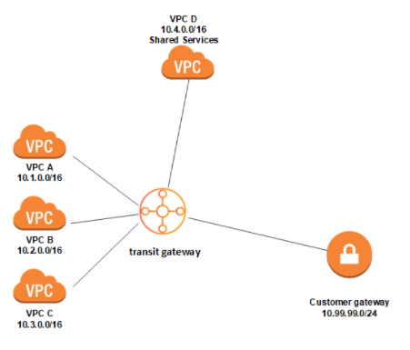
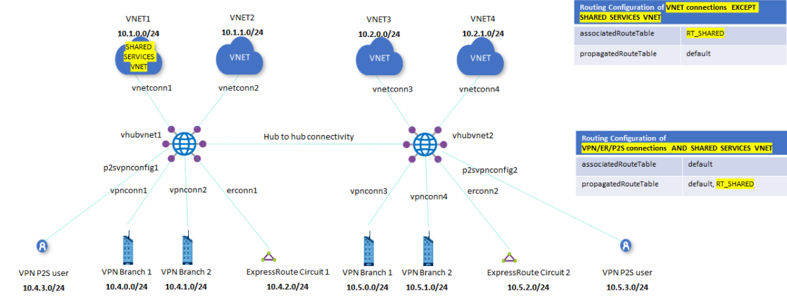

# AWS to Azure
---
Please note this is not official Microsoft or AWS documentation. Everything is offered as an opinion with no guarantees

---
# Contents

**[Networking](#networking)**\
<!-- **[Governance](#transit-gateway)** -->

## Networking

* **[AWS Transit Gateway](#transit-gateway)**
    * **[Centralized Router](#tgw-centralized)**
    * **[Isolated](#tgw-isolated)**
    * **[Isolated Shared Services](#tgw-isolated-shared-services)**
    * **[Peering](#tgw-peering)**
    * **[Centralized Outbound](#tgw-centralized-outbound)**
    * **[Appliance VPC](#tgw-appliance-vpc)**

* **[VPC Peering](#vpc-peering)**
* **[Hub/Spoke with Firewall](#hub-and-spoke-with-firewall)**
* **[Regional DX Sharing](#regional-direct-connect-sharing)**
* **[DX vs ExpressRoute](#direct-connect-vs-expressroute)**

### Transit Gateway
This is AWS' transit hub that allows you to interconnect VPCs and on-prem networks. [AWS docs Link](https://docs.aws.amazon.com/vpc/latest/tgw/what-is-transit-gateway.html)

* **[Centralized Router](#tgw-centralized)**
* **[Isolated](#tgw-isolated)**
* **[Isolated Shared Services](#tgw-isolated-shared-services)**
* **[Peering](#tgw-peering)**
* **[Centralized Outbound](#tgw-centralized-outbound)**
* **[Appliance VPC](#tgw-appliance-vpc)**

#### TGW Centralized

[AWS](#centralized-aws)\
[Azure](#centralized-azure)

##### Centralized AWS
Leverages the tgw as central router to the topology. [Docs](https://docs.aws.amazon.com/vpc/latest/tgw/transit-gateway-centralized-router.html)

##### Centralized Azure
AKA [global transit network](https://docs.microsoft.com/en-us/azure/virtual-wan/virtual-wan-global-transit-network-architecture#globalnetworktransit) architecture where Azure Virtual WAN acts as enterprise and/or cloud transit router and terminates vnet connections, vpn tunnels (s2s, p2s) and expressroute connections.

[back to Tgw](#transit-gateway)\
[back to Networking](#networking)\
[back to top](#aws-to-azure)

#### TGW Isolated
[AWS](#isolated-aws)\
[Azure](#isolated-azure)\
[Azure custom](#isolated-azure-custom)\
[Azure custom isolated branches](#isolated-azure-custom-isolated-branches)

##### Isolated AWS
In this architecture, the VPCs only have network layer connectivity to on-prem prefixes. [AWS docs Link](https://docs.aws.amazon.com/vpc/latest/tgw/transit-gateway-isolated.html)

Here, you have 2 route tables:\
* The one attached to your isolated VPCs: where you only add routes to on-prem prefixes
* The one attached to your on-prem/vpn attachment: where you add routes to your VPC

##### Isolated Azure
In the simple vwan isolated topology, you will create an additional route table (`RT-VNET`) and propagate it to the `Default` route table. [Azure Docs](https://docs.microsoft.com/en-us/azure/virtual-wan/scenario-isolate-vnets#design)

* Virtual networks:
    * Associated route table: RT_VNET
    * Propagating to route tables: Default
* Branches:
    * Associated route table: Default
    * Propagating to route tables: RT_VNET and Default

##### Isolated Azure Custom
Requirement: "prevent a specific set of VNets from being able to reach other specific set of VNets", while allowing all VNETs network connectivity to branches. [Azure Docs](https://docs.microsoft.com/en-us/azure/virtual-wan/scenario-isolate-vnets-custom)

* Create two custom route tables in the Azure portal, RT_BLUE and RT_RED.
* For route table RT_BLUE, for the following settings:
    * Association: Select all Blue VNets.
    * Propagation: For Branches, select the option for branches, implying branch(VPN/ER/P2S) connections will propagate routes to this route table.
* Repeat the same steps for RT_RED route table for Red VNets and branches (VPN/ER/P2S).

[back to Tgw](#transit-gateway)\
[back to Networking](#networking)\
[back to top](#aws-to-azure)

##### Isolated Azure Custom Isolated Branches
Requirement: "prevent a specific set of VNets from reaching another set of VNets. Likewise, branches (VPN/ER/User VPN) are only allowed to reach certain sets of VNets." [Azure Docs](https://docs.microsoft.com/en-us/azure/virtual-wan/scenario-isolate-virtual-networks-branches)

*This scenario leverages a secure hub by deploying **Azure Firewall** in the VWAN hub.* [Here is the workflow to get this accomplished](https://docs.microsoft.com/en-us/azure/virtual-wan/scenario-isolate-virtual-networks-branches#architecture)

[back to Tgw](#transit-gateway)\
[back to Networking](#networking)\
[back to top](#aws-to-azure)

#### TGW Isolated Shared Services
In this model, the VPCs are isolated but need to communicated with a shared services VPC and connect to on-prem.

[AWS](#isolated-sharedsvc-aws)\
[Azure](#isolated-sharedsvc-azure)

##### Isolated SharedSvc AWS
The AWS implementation leverages:
* One route table for VPC attachments with on-prem routes and a route to the shared services VPC. [Docs link](https://docs.aws.amazon.com/vpc/latest/tgw/transit-gateway-isolated-shared.html)
* One route table for the shared services VPC attachment with routes to on-prem and isolated VPCs

##### Isolated SharedSvc Azure
Requirements:
* Isolated VNETs can communicate with:
    * Shared VNETs and Branches
* Shared VNETS can communicate with:
    * Isolated VNETs, Shared VNETs, Branches
* Branches can communicate with:
    * Isolated and Shared VNETs, other Branches

**Route table design** ([Azure Docs](https://docs.microsoft.com/en-us/azure/virtual-wan/scenario-shared-services-vnet))
* Isolated virtual networks:
    * Associated route table: RT_SHARED
    * Propagating to route tables: Default
* Shared services virtual networks:
    * Associated route table: Default
    * Propagating to route tables: RT_SHARED and Default
* Branches:
    * Associated route table: Default
    * Propagating to route tables: RT_SHARED and Default

*If your Virtual WAN is deployed over multiple regions, you will need to create the RT_SHARED route table in every hub*

[back to Tgw](#transit-gateway)\
[back to Networking](#networking)\
[back to top](#aws-to-azure)

### TGW Peering

[AWS](#aws-tgw-peering)\
[Azure](#azure-vwan-any-to-any)

#### AWS TGW Peering
In AWS, if you'd like 2 tgws to share routes you'd need to peer them, which allows for route sharing in each of the tgw's default route tables. [Docs](https://docs.aws.amazon.com/vpc/latest/tgw/transit-gateway-peering-scenario.html)

#### Azure vWAN Any-to-Any
By default, Azure vWAN standard allows hub-to-hub connectivity. Meaning routes are shared between vWAN hubs from the same vWAN by default. [Azure Docs](https://docs.microsoft.com/en-us/azure/virtual-wan/scenario-any-to-any)

[back to Tgw](#transit-gateway)\
[back to Networking](#networking)\
[back to top](#aws-to-azure)

### TGW Centralized Outbound
This scenario is common if you have a requirement or need to leverage a NAT gateway deployed in your central VPC for all other VPC outbound traffic.

With Azure, your VNET resources leverage Azure managed NAT and Internet gateways by default, therefore you do not need to add a NAT gateway to your VNETs.

#### Centralized Azure
If you have a requirement to know your outbound IP addresses, you can configure a NAT gateway, then attach it to the appropriate subnet. [Azure Docs]((https://docs.microsoft.com/en-us/azure/virtual-network/nat-overview))

#### Centralized AWS
Here, you create a tgw route table with a 0.0.0.0/0 route pointing to the outbound VPC, then add specific prefixes pointing to respective VPCs. [Docs](https://docs.aws.amazon.com/vpc/latest/tgw/transit-gateway-nat-igw.html)

[back to Tgw](#transit-gateway)\
[back to Networking](#networking)\
[back to top](#aws-to-azure)

### TGW Appliance VPC
This model satisfies the requirement for east-west and north-south traffic inspection by an appliance (NVA) in a shared services VPC.

[AWS](#aws-appliance-vpc)
[Azure with NVA](#azure-vwan-nva-routing)
[Azure with Azure Firewall](#azure-vwan-with-azure-firewall)

#### AWS Appliance VPC

Here, both `east-west` (vpc to vpc, vpc to on-prem) and `north-south` (vpc-to-inet) traffic are redirected to the appliance in the shared services vpc for inspection before being forwarded. [Docs](https://docs.aws.amazon.com/vpc/latest/tgw/transit-gateway-appliance-scenario.html)

#### Azure vWAN NVA routing
We'll discuss a few models here:
* [Route some VNET traffic through an appliance](#some-vnets-through-nva)
* [Route only Internet-bound traffic through an appliance](#route-inet-bound-throush-nva)

##### Some VNETs Through NVA
In this model, traffic to and from VNETs 5 and 6, 7 and 8 will be routed through the NVAs in VNETs 2 and 4 respectively. Traffic to and from VNETs 1, 2, 3 and 4 (intra and to branches) will not be routed through the NVA. [Azure docs](https://docs.microsoft.com/en-us/azure/virtual-wan/scenario-route-through-nva)

This model essentially secures VNETs 5 and 6, 7 and 8.

##### Route INET-bound Through NVA
In this model, Internet-bound traffic from all VNETs is routed through the NVA in the DMZ VNET while VNET-to-VNET and VNET-to-Branch traffic leverages the vWAN gateway. [Azure docs](https://docs.microsoft.com/en-us/azure/virtual-wan/scenario-route-through-nvas-custom)

#### Azure vWAN with Azure Firewall
Requirements:
* VNET-to-VNET: no inspection
* VNET-to-INET: AzFirewall
* VNET-to-Branch: AzFirewall
* Branch-to-Branch: No inspection
* Branch-to-INET: No inspection
* Branch-to-VNET: AzFirewall

To accomplish this, we will create a route table `RT_Vnets` for out VNET associations but we will not propagate it to the default route table, where our branch routes are. [Azure docs](https://docs.microsoft.com/en-us/azure/virtual-wan/scenario-route-between-vnets-firewall)

**Route table static routes routes:**
* `RT_VNETs`: 0.0.0.0/0 -> Azure firewall
* `Default`: `<Vnet prefixes>` -> Azure firewall

In addition, you can add a `0.0.0.0/0` -> `AzFw` route in the default route table to route all branch traffic destined to the Internet through Azure Firewall.

[back to Tgw](#transit-gateway)\
[back to Networking](#networking)\
[back to top](#aws-to-azure)